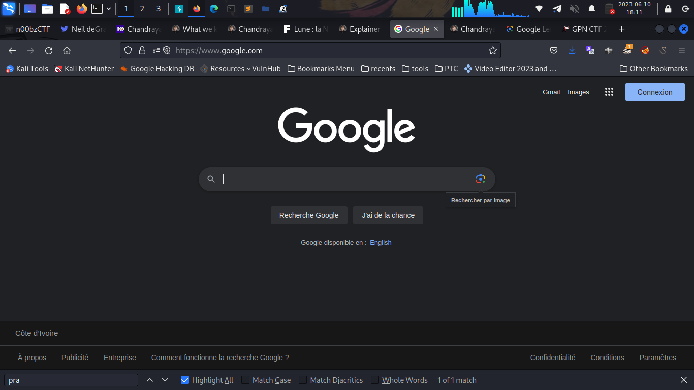
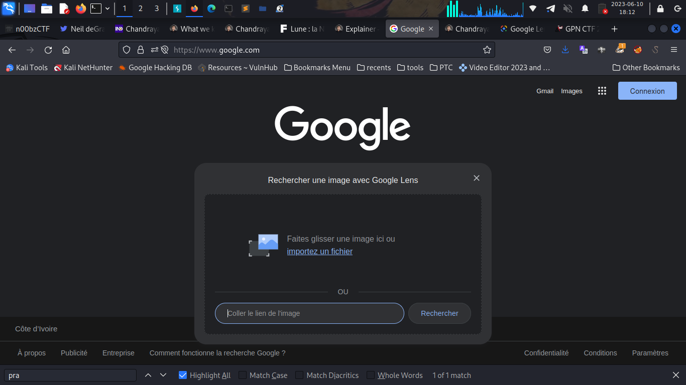
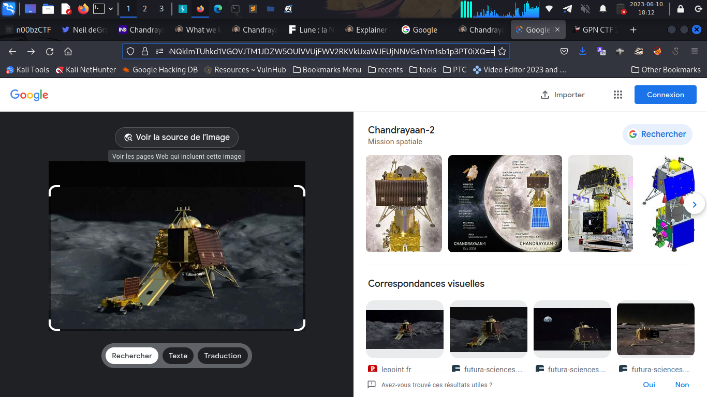

# n00bzCTF write-up
##### @author : moulooholo@gmail.com
___
---
---
___

## Sanity check (Misc)
 Go to , ,and check the page source. Search all strings begin by "n00b{", you will find the flag.
 <details>
 <summary>View flag</summary>
 :checkered_flag:
 flag = <b>n00bz{w3lc0m3_t0_n00bzCTF_2023!}</b>
</details>
 
---

## Amazing Song Lyrics (Misc)
Download "chall.png" file. It is American Sign Language(ASL). Check https://upload.wikimedia.org/wikipedia/commons/thumb/c/c8/Asl_alphabet_gallaudet.svg/424px-Asl_alphabet_gallaudet.svg.png and decode chall.png to get flag (you can use this link .
<details>
<summary>View flag</summary>
:checkered_flag:
flag = <b>n00bz{americansignlanguagedecoded}</b>
</details>

---

## Google Form 1 (Misc)
Go to the google form  or this , and check the page source. Search all strings begin by "n00b{", you will find the flag.
<details>
<summary>View flag</summary>
:checkered_flag:
flag = <b>n00bz{1n5p3ct_3l3m3n7_ftw!}</b>
</details>

---

##  My Chemical Romance (Misc)
We've '186808155710' like entry. Separate them into groups of two, you can use this python code:
```
ch='186808155710'
i=0
sep=''
while i < len(ch):
	sep +=' '+ch[i:i+2]
	i+=2
sep=sep[1:]
print(sep)
```
Then paste the output in field of site , and decrypt. You obtained a string paste it into field of site . In above, it show you the correct spelling. 
<details>
<summary>View flag</summary>
:checkered_flag:
flag = <b>n00bz{aeroplane}</b>
</details>

---

## Big Blacklist (Misc)
Connect to the server with `nc challs.n00bzunit3d.xyz 8412`. We see that there is a blacklist which prevents us from certain orders. To bypass that, we'll use unicode character . So in python console run `print("\u2093")`, and replace the **'x'** of **'exec'** by the output. 
You must get `eₓec(input())` to pass into server. Then, entry `import pty; pty.spawn("/usr/bin/sh")`. You'll get a shell prompt, now you'll do everythings according ctf user.
To get the flag run `cat flag.txt`. 
<details>
<summary>View flag</summary>
:checkered_flag:
flag = <b>n00bz{blacklist.pop()\_ftw!_7
a5d2f8b}</b>
</details>

---

## Numbers (Misc)
Run this following python script to solve the challenge : 
```
#!/usr/bin/env python3

from pwn import *
import re

host='challs.n00bzunit3d.xyz'
port=13541
try:
	conn = remote(host, port)

	try:
		while True:
			print(conn.recvline())  # "Round #"
			challenge_msg = conn.recvline().decode()
			print(challenge_msg)
			if "n00bz" in challenge_msg:
				print(challenge_msg)
			matches = re.findall(r'\d+', challenge_msg)
			number = int(matches[0])
			limit = int(matches[1])

			count = 0
			for i in range(1, limit):
				digits = str(i)
				for digit in digits:
					if digit == str(number):
						count += 1

			conn.sendline(bytes(str(count),'utf-8'))

			result = conn.recvline().decode()
			print(result)

		print(flag)

	except EOFError:
		print("Error: Connection closed unexpectedly.")

	except KeyboardInterrupt:
		print("Program interrupted...")

	conn.close()

except Exception as e:
	print("Error:", str(e))
```
<details>
<summary>View flag</summary>
:checkered_flag:
flag = <b>n00bz{blacklist.pop()\_ftw!_7
a5d2f8b}</b>
</details>

---

## Google Form 2 (Misc)
The solution was just to change /viewform by /viewanalytics from link. You must get : 
<details>
<summary>View flag</summary>
:checkered_flag:
flag = <b>n00bz{7h1s_1s_th3_3nd_0f_g00g
l3_f0rm5_fl4g_ch3ck3rs}</b>
</details>


---

## Crack & Crack (Forensic)
Download 'flag.zip' file and do on the terminal :
```
cd <flag.zip_directory's_path>
zip2john flag.zip > hash1
john hash1 -w=/usr/share/wordlists/rockyou.txt
unzip flag.zip
<pass_the_password>
pdf2john flag.pdf >hash2
john hash2 -w=/usr/share/wordlists/rockyou.txt
```
Open flag.pdf file, pass the password found with john and get the flag
<details>
<summary>View flag</summary>
:checkered_flag:
flag = <b>n00bz{CR4CK3D_4ND_CR4CK3D_1a4
d2e5f}</b>
</details>


## Avengers (Forensic)
Download 'flag.avi' file and extract all streams in using this site . Then unzip files in a repository like **extract/**. Next use this code to obtained texts (prompted binairy) from images, but before, you must sure to have all modules (PIL, pytesseract, numpy). Otherwise run on your terminal `sudo python3 -m pip install PIL pytesseract numpy`. Then : 
```
import os
from PIL import Image
import pytesseract
import numpy as np

def get_file_paths(directory):
	file_paths = []
	for root, directories, files in os.walk(directory):
		for filename in files:
			filepath = os.path.join(root, filename)
			file_paths.append(filepath)
	return sorted(file_paths)

directory_path = '<Directory_including_only_images_path>'
file_paths = get_file_paths(directory_path)
returnedtext=''
for file in file_paths:
	filename = file
	img = np.array(Image.open(filename))
	text = pytesseract.image_to_string(img)
	returnedtext+=' '+text
textout_list=', 0b'.join(returnedtext.split())
print('[0b'+textout_list+']')
```
Execute the script and copy the output to paste it in the new following script:
```
liste=<paste_here_the_above_output>
for i in range(len(liste)):
	print(chr(int(liste[i])),end='')
```
Run the sciprt and you'll get the flag.
<details>
<summary>View flag</summary>
:checkered_flag:
flag = <b>n00bz{7h1s_1s_4_v3ry_l0ng_fl4
g_s0_th4t_y0u_c4nn0t_s0lv3_7h3_ch4ll3ng3_m4nu4lly_b7w_73s3r4c7_1s_4_v3ry_g00d_t00l!}</b>
</details>

---

## Hecked (Forensic)
Download 'dump.pcap' file and open it with Wireshark. Then right click on the first packet and select **"Follow > TCP Stream"**. You'll find the Name and version of vulnerable service. Go to the 4th stream to get the first command typed by hacker. In resume, you must run `echo -n 'vsFTPd_2.3.4_id' |md5sum |cut -d' ' -f1`. Copy the output and put it in flag format. That give **"n00bz{a806fef72a92508b7a64776bb83ad4cb}"**.
<details>
<summary>View flag</summary>
:checkered_flag:
flag = <b>n00bz{a806fef72a92508b7a64776
bb83ad4cb}</b>
</details>

---

## QRazy CSV (Forensic)
Download "secret.csv" file and modify it to have the correct csv format. Then run this python code from the same directory of **'secret.csv'** location : 
```
#!/usr/bin/env python3

from PIL import Image, ImageDraw

secret = open('secret.csv', 'r').read().split('\n')[1:-1]
cells = {}
for _ in range(29):
   cells[_] = []

for _ in secret:
   a, b = _.split(',')
   cells[int(a)].append(int(b))
print(cells)

colored = []
for _ in secret:
    a, b = _.split(',')
    colored.append((int(a), int(b)))

width, height = 2900, 2900
rows, cols = 29, 29
cell_size = width // cols  # Size of each grid cell

image = Image.new("RGB", (width, height), "white")
draw = ImageDraw.Draw(image)

for row in range(rows + 1):
    y = row * cell_size
    draw.line([(0, y), (width, y)], fill="black")  # Horizontal lines

for col in range(cols + 1):
    x = col * cell_size
    draw.line([(x, 0), (x, height)], fill="black")  # Vertical lines

for cell in colored:
    row, col = cell
    x1 = col * cell_size
    y1 = row * cell_size
    x2 = x1 + cell_size
    y2 = y1 + cell_size
    draw.rectangle([(x1, y1), (x2, y2)], fill="black")

image.save("qrcode.png")  # Save the image
image.show()  # Display the image
```
Go to  and scan "qrcode.png" image, you'll get the flag.
<details>
<summary>View flag</summary>
:checkered_flag:
flag = <b>n00bz{qr_c0d3_1n_4_t3xt_f1l3_
w0w!!!!!!}</b>
</details>

---

## BeepBop (Forensic)
Download "chall.wav" file and open it with qsstv applicaton (**`apt install qsstv`** on Debian distribution). Then, you will get the flag in **"Receive"** tab.
<details>
<summary>View flag</summary>
:checkered_flag:
flag = <b>n00bz{beep_bop_you_found_me!}</b>
</w0w!!!!!!}</b>>

---

## LSB (Forensic)
Download "chall.wav" file and open a terminal where the file is stored. Run `stegolsb wavesteg -ri chall.wav -o flag.txt -b 30` to get the flag. You can download the command with `python3 -m pip install stego-lsb`
<details>
<summary>View flag</summary>
:checkered_flag:
flag = <b>n00bz{L5B_1n_w4v_f1l3s?!!!}</b>
</details>

---

## Mission Moon (OSINT)
Download the 'mission_moon.webp' file and do reverse search by google search by image (Google lens) .
Import 'mission_moon.webp' file  and click on **'view image source'** button . Do **Ctrl^F** and research **'jatan.space'** pattern. The first occurrence is supposed to be the correct one . Once the page, you will see that **'Vikram'** is our lander, **'Pragyan'** is our rover, and the planned landing site is **'70.9° S, 22.8° E'**, so *70.9* as latitude and *22.8* as longitude. Putting all this information together, we get <b>n00bz{Vikram_Pragyan_70.9_22.8}</b> as flag.
<details>
<summary>View flag</summary>
:checkered_flag:
flag = <b>n00bz{Vikram_Pragyan_70.9_22.8}</b>
</details>

---

## Damn (OSINT)
Download the 'damn.png' file and do reverse search by google search by image (Google lens). Click on **'view image source'** button . The first occurrence is supposed to be the correct one . Once the page, you'll see that the full name is Nova Kakhovka. Therefore the flag is n00bz{Nova_Kakhovka}
<details>
<summary>View flag</summary>
:checkered_flag:
flag = <b>n00bz{Nova_Kakhovka}</b>
</details>

---

## Lost (OSINT)
Download "where.png" file and open it. when you zoom it, you'll see a brigde. Search with google lens, zoom on the brigde. According to google suggestions, the image seems to have been taken at **Vallejo Street Pier 9**. But after several attempts, the good name for this challenge is Vallejo Steps (obtained from Google Maps)
You can also check 
<details>
<summary>View flag</summary>
:checkered_flag:
flag = <b>n00bz{Vallejo_Steps}</b>
</details>

---

## Try to hack me (OSINT)
Search "brayannoob" on github site (). You'll see a single user. Go to his first commit on the "BrayanResearch" repository, you will see a username. Search this username on tryhackme with this link . And you get the flag.
<details>
<summary>View flag</summary>
:checkered_flag:
flag = <b>n00bz{y0u_p4ss3d_th3_ch4ll3ng
3_c0ngr4tul4t10ns_7c48179d2b7547938409152641cf8e}</b>
</details>

---

## The online Odyssey (OSINT)
Search the username "blackhat_abhinav" on Github and you'll find this instagram link . Copy and paste the secret link in url bar. You'll find in google map page a username which used on Twitter . Click on "ALT" on first image, and you get the flag.
<details>
<summary>View flag</summary>
:checkered_flag:
flag = <b>n00bz{gr0tt4_1sl4nd_1s_4_n1c3
_pl4c3_t0_v1s1t}</b>
</details>

---

## John Doe Strikes Again (OSINT)
First, run : 
```
def xor_encrypt_decrypt(plaintext, key):
    ciphertext = bytearray()
    for i in range(len(plaintext)):
        ciphertext.append(plaintext[i] ^ key[i % len(key)])
    return ciphertext

plaintext = b'\x13\x00\x1d-A*!\x00Q\x16R\x02\x12\x07\n\x1b>\x0e\x06\x1a~O-D CU\t\x0e\x06 E2\n\x17bA#\x0b\t>O\x11\x011O\tH*\x1b\x10-\x08\x00)E\x02\nMck~)\x07"\x01H*+\n_\x01\x00\x00\x00c\n\x00!\x12V\r\x1d4A\x19\x16\x0b"O!N(\x00\x13Dy\x02\x000\x08\rn\x16\x19E\x16,\x0fS\x17H+\x1c\x03N)\nEU1\x0e\x01c\x10\x1b+\x16\x02\x0c\x1d-A\x11\x15\r8\x16H\x0f#\x0e\x0cOx'
key = b'YouCanNeverCatchJohnDoe!'
ciphertext = xor_encrypt_decrypt(plaintext, key)
print(ciphertext.decode('utf-8'))
```
Go to  site and search his id "31zdugxvkayexc4hzqhixxcfxb4y". While he likes music, you'll view that he has an account on Spotify . Once in the account, the information pushes us go to Discord. Then in Discord, the information redirect us to noobzctf site. By checking john Doe profile, we'll see his team name a cypher text. Let's decrypt it :
```
def xor_encrypt_decrypt(plaintext, key):
    ciphertext = bytearray()
    for i in range(len(plaintext)):
        ciphertext.append(plaintext[i] ^ key[i % len(key)])
    return ciphertext

plaintext = b'\r\x07\x1c-\nN\x19\x04\x0fE0"\x02\x1f7\x00#\x01\x03N\x13\x0e\x1c\x01'
key = b'YouCanNeverCatchJohnDoe!'
ciphertext = xor_encrypt_decrypt(plaintext, key)
print(ciphertext.decode('utf-8'))
```
The output informs to go to Wayback Machine . Browse  and go to **"Site Map"** tab. You can check all modification, but the good is . There is a redirect option in the Website of John Doe’s team. Click on it to find the top secret page. Do "Ctrl+A", you'll find a cypher text, decrypt it and get the flag.
```
def xor_encrypt_decrypt(plaintext, key):
    ciphertext = bytearray()
    for i in range(len(plaintext)):
        ciphertext.append(plaintext[i] ^ key[i % len(key)])
    return ciphertext

plaintext = b'7_E!\x1b\x15 U)U\x1cp>\x17W\x06\x15\\\x1b\rp\x1fV~\x14=[sT_\x00RZ:\x1cs\x15+P\x1ey\x017$t'+~\x1d_Fb\x1c'
key = b'YouCanNeverCatchJohnDoe!'
ciphertext = xor_encrypt_decrypt(plaintext, key)
print(ciphertext.decode('utf-8'))
```

You can also view this site 
<details>
<summary>View flag</summary>
:checkered_flag:
flag = <b>n00bz{n0_0n3_c4n_3sc4p3_MR.05
1N7,\_n0t_3v3n_J0HN_D03!}</b>
</details>

---

## Club_N00b (Web)
Go to .
The homepage highlights the word **"radical"** with some css styling, and a button. Clicking the button **"Check Status""** you go to `/check?secret_phrase=nope` page. Change **"nope"** to **"radical"** to get the flag.
<details>
<summary>View flag</summary>
:checkered_flag:
flag = <b>n00bz{see_you_in_the_club_act
ing_real_nice}</b>
</details>

---

## Robots (Web)
Go to . Add ".txt" to the link to get the flag.
<details>
<summary>View flag</summary>
:checkered_flag:
flag = <b>n00bz{1_f0und_7h3_r0b0ts!}</b>
</details>

---

## Secret Group (Web)


---

## Conditions (Web)


---

## CaaS (Web)


---

## CaaS2 (Web)


---


##


---


##


---

## Welcome (Rev)
Download 'chal' file and do on the terminal :
```
cd <chal_directory's_path>
file chal
strings chal | grep n00bz
```
<details>
<summary>View flag</summary>
:checkered_flag: 
flag = <b>n00bz{N3v3R_$torE_$ENs1TIV3_1
nFOrMa7IOn_P1aiNtexT_In_yoUr_bin4rI3S!!!!!}</b>
</details>
